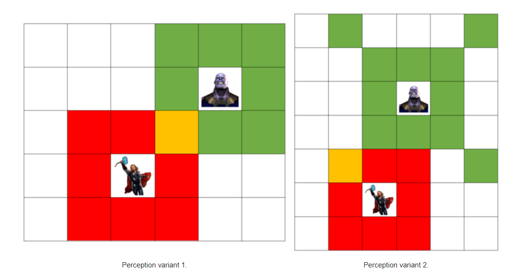

# A* Algorythm

## This was done as homework for Intro to AI course at Innopolis University.

### Task

You are Thanos. You are searching for the Infinity stone and trying to avoid the Avengers. Hulk, Thor, and Captain
Marvel are after you, but you should not let them see you. Each of them has a different perception zone,
marked by red in the figures below:


Captain America is not with them, but he lost his shield during his last battle. Finding this shield allows you to pass
through the perception zones of the Avengers safely (except for Captain Marvel, because she is strong and independent).

There are 2 variants of this problem with different perception zones for you (Thanos). The cells you can see are marked
by green (or yellow when you perceive a cell that your enemy can also perceive) in the following figures.



Thanos (you), the Avengers, the shield, and the Infinity stone are all located randomly on a **9**×**9**
grid. You do not know the locations of any of them except for the stone. Your task is to navigate to the stone without
being seen by any Avenger and reporting back the length of the shortest path to the stone. If the map is unsolvable, you
should output **−1** for the path length.

Note that this is an interactive problem. You do not start knowing the whole map. You must move through the map to
perceive new cells. You cannot teleport or jump outside of the map.

Please refer to the [PDF](./readme-files/Assignment%201%20v1.1.pdf) for more details ;)

### Input

The first line contains a single integer (1 or 2) representing the perception zone variant for Thanos.

The second line contains 2 integers separated by a space, representing the (*x*,*y*)
position of the infinity stone.

After that starts the interaction described in the section below. The symbols representing the characters/items are as
follows:

| **Symbol** | **Item**                        |
|------------|---------------------------------|
| P          | **P**erception zone of an enemy |
| H          | **H**ulk                        |
| T          | **T**hor                        |
| M          | Captain **M**arvel              |
| S          | Captain America's **s**hield    |
| I          | The **I**nfinity stone          |

### Interaction

After receiving the variant number and the infinity stone position, you can start sending queries to the map.
There are only 2 possible queries:

* **m** *x y*: **m**ove to position (*x*,*y*)
  and request perceived cells. The map will respond by sending an integer *n*
  representing the number of perceived items, followed by *n*
  lines in the format *x* *y* *c*, where *x* and *y*
  are integers representing the (*x*,*y*)
  coordinate of the perceived item, and *c*
  is a character representing the item itself (as outline above in the input format section)
* **e** n: **e**nd the game, with the integer *n*
  being the solutions (the length of the shortest path, or **−1** if unsolvable).

### Note

Input and output to/from the map are done using stdin/stdout. Use stdout to send commands to the map, and stdin to
receive the responses back.

To clarify further, here is a sample interaction with one of the test cases. The map looks like so:

```
A..PPMPP.
...IPPP..
.....P...
.........
...P.....
S.PHP..PP
...P...PT
.......PP
.........
```

For the purpose of this demonstration, the *x*-axis is the horizontal one (naturally making the *y*-axis vertical),
and the origin (0,0) is at the top left corner.

You start by reading the following from *stdin*:

```
1
3 1
```

The first line tells you that Thanos has the first variant of the perception zone, while the second one tells
you that the stone is located at (**3**,**1**). You know nothing about the map yet, so you move to (**0**,**0**)
(to avoid entering any possible danger zone) by printing (to *stdout*):

```
m 0 0
```

The map responds to you with the following:

```
0
```

since you see nothing yet.
You decide to move to (**1**,**0**):

```
m 1 0
```

to which the map responds with:

```
0
```

so you keep moving forward:

```
m 2 0
```

but now you can see 2 items around you:

```
2
3 0 P
3 1 I
```

We have found the stone! Now we just need to get around the enemy's perception zone to grab it:

```
m 2 1
```

Note that you should always read the map's response:

```
2
3 0 P
3 1 I
```

which didn't change because the items in your perception didn't change. Now you can finally grab the stone:

```
m 3 1
```

After reading the same result from the map again, you can finally decide that this map needed 4 steps (at minimum)
to reach the stone, so you output:

```
e 4
```

To signal that you know the final answer and exit the game.